<div align="center">

# Hey, I'm Jack 👋

**Systems Architect · Research Engineer · Autonomous Systems Developer**

*Self-taught. Multi-repo open-source contributor. Python, graph tooling, ML infrastructure.*

[](https://github.com/1HazyOne707)
[](https://github.com/1HazyOne707)

</div>

<div align="center">
  
</div>

<div align="center">
  
</div>


---

### 🧭 What I do

I contribute production-grade fixes and features to established open-source projects. My work spans **graph databases, RL training infrastructure, and developer tooling**, with a track record of getting PRs merged by real maintainers on real codebases.

```yaml
focus:
  - Python (strict typing, mypy, ruff)
  - Graph databases & knowledge graphs (Neo4j)
  - ML/RL infrastructure
  - Developer tooling & automation
  - Git/GitHub workflow engineering
```

---

### 🔧 Featured contributions

| Project | What I shipped |
|---|---|
| [**neo4j-labs/neocarta**](https://github.com/neo4j-labs/neocarta) | Context-manager support across all connectors · Fixed unreliable embedding-write counters · Hard-coded BigQuery platform metadata |
| [**neo4j/neo4j-graphrag-python**](https://github.com/neo4j/neo4j-graphrag-python) | Added structured output support to `AnthropicLLM` |
| [**JumpMasters/quartermaster**](https://github.com/JumpMasters/quartermaster) | Fixed N+1 query pattern in order repository · Bounded request field lengths for API safety · Shaped public API error responses |
| [**qorexdevs/quicksave**](https://github.com/qorexdevs/quicksave) | Added `diff --name-only` and `find --count` CLI features |
| [**SikamikanikoBG/homelab-monitor**](https://github.com/SikamikanikoBG/homelab-monitor) | Built TLS certificate expiry tracking · Maintenance-window alert silencing |
| [**verl-project/verl**](https://github.com/verl-project/verl) *(ByteDance)* | Atropos RL environment integration with GRPO training *(open, awaiting maintainer review)* |
| [**HolmesGPT**](https://github.com/HolmesGPT/holmesgpt) *(CNCF SRE Agent)* | 3 open PRs awaiting review — tool-search integration, turn-handling fixes, HealthCheck execution ordering |

*All contributions are independently verifiable via merged PR history — no inflated claims.*

---

### 📊 GitHub Stats

<div align="center">


</div>

---

### 🛠️ Tech Stack


---

### 🤝 Open to

- **Sponsorship** — supporting ongoing open-source contribution work
- **Contract/freelance work** — Python, graph databases, ML infrastructure, dev tooling
- **Interesting problems** — always happy to talk shop

📍 California · 💬 Reach out via GitHub

<div align="center">

*If my contributions have helped your project, consider [sponsoring my work](https://github.com/sponsors/1HazyOne707).*

</div>
